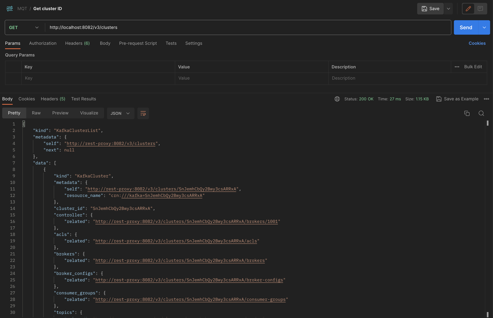
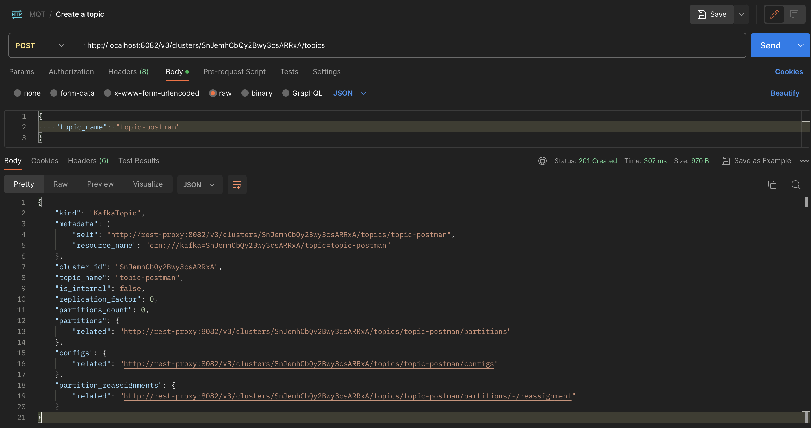
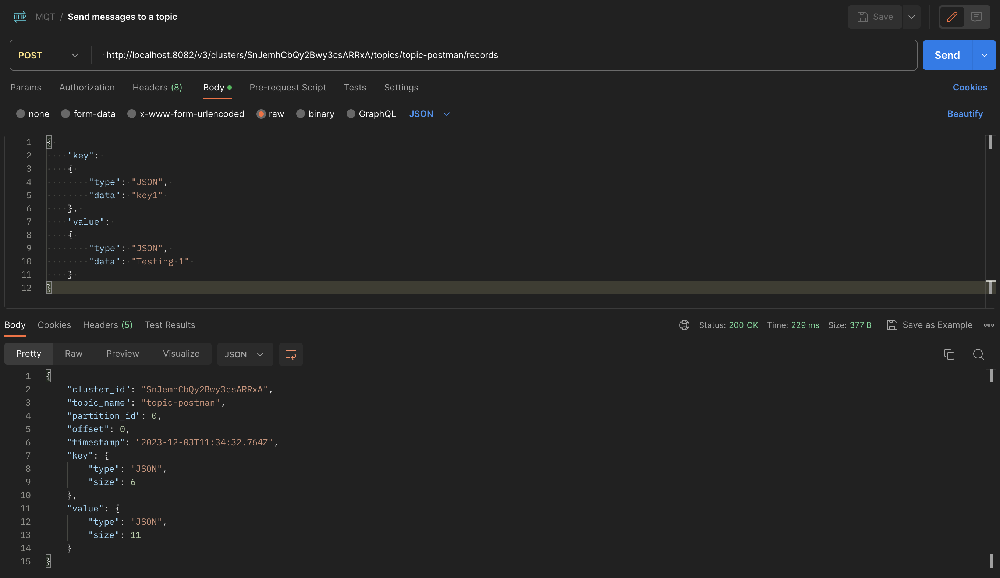
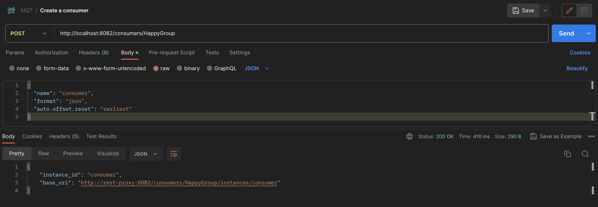
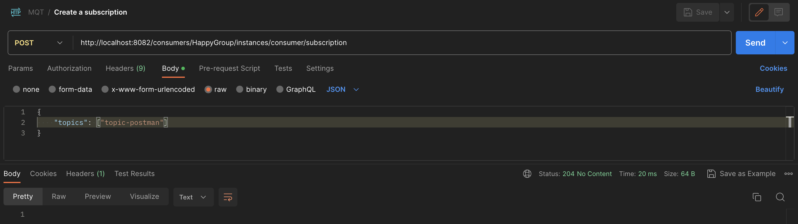
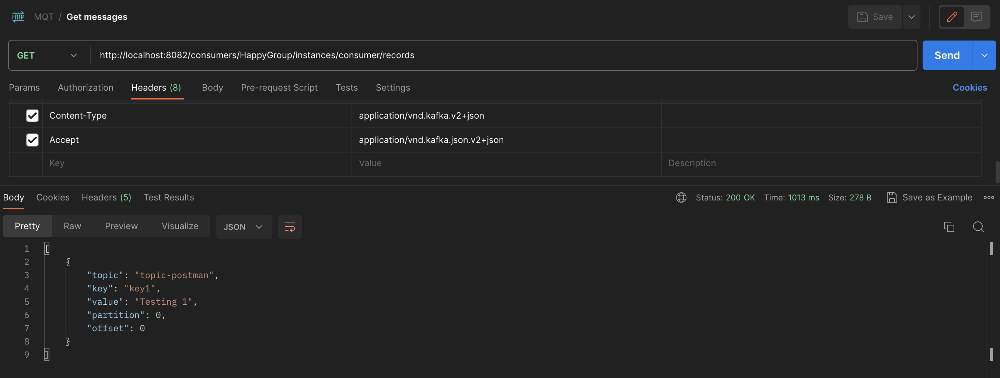

## 1. Get cluster ID

**GET** http://localhost:8082/v3/clusters


## 2. Create a topic

**POST** http://localhost:8082/v3/clusters/${clusterID}/topics

**Body -> raw -> JSON**
```json
{
  "topic_name": "topic-postman"
}
```


## 3. Send messages to a topic
**POST**  http://localhost:8082/v3/clusters/SnJemhCbQy2Bwy3csARRxA/topics/topic-postman/records

**Body -> raw -> JSON**
```json
{
  "key":
  {
    "type": "JSON",
    "data": "key1"
  },
  "value":
  {
    "type": "JSON",
    "data": "Testing 1"
  }
}
```


## 4. Read messages from a topic

### a. create a consumer
**POST** http://localhost:8082/consumers/HappyGroup

**Body -> raw -> JSON**
```json
{
  "name": "consumer",
  "format": "json",
  "auto.offset.reset": "earliest"
}
```
**Headers -> Content-Type -> application/vnd.kafka.v2+json**


### b. create a subscription
**POST** http://localhost:8082/consumers/HappyGroup/instances/consumer/subscription

**Body -> raw -> JSON**
```json
{
  "topics": [
    "topic-postman"
  ]
}
```
**Headers -> Content-Type -> application/vnd.kafka.v2+json**


### c. get messages
**GET** http://localhost:8082/consumers/HappyGroup/instances/consumer/records

**Headers -> Content-Type -> application/vnd.kafka.v2+json**

**Headers -> Accept -> application/vnd.kafka.json.v2+json**
