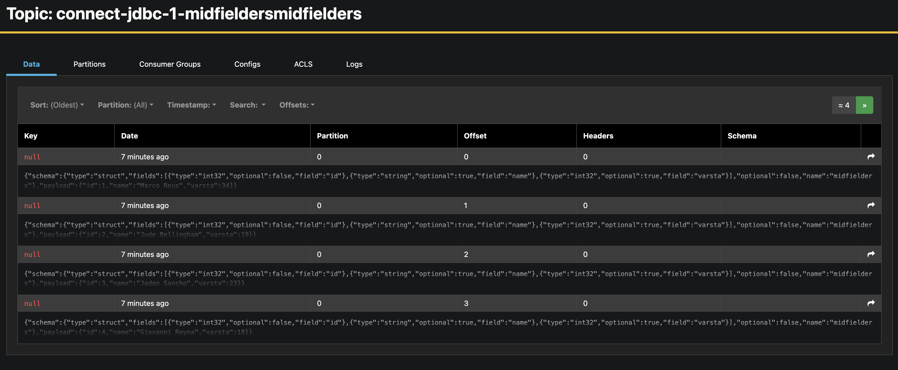

### 1. Go to http://localhost:8080 and login with
System: PostgreSQL Server: postgres Username: demo Password: demo Database: footballPlayers

### 2. Create a new table
```sql
CREATE TABLE IF NOT EXISTS midfielders ( 
id INT PRIMARY KEY, 
name VARCHAR(255), 
varsta INT 
);
```


### 3. Insert some data
```sql
INSERT INTO midfielders VALUES (1, 'Marco Reus', 34);
INSERT INTO midfielders VALUES (2, 'Jude Bellingham', 19);
INSERT INTO midfielders VALUES (3, 'Jadon Sancho', 23);
INSERT INTO midfielders VALUES (4, 'Giovanni Reyna', 18);
```


### 4. Check connector-plugins http://localhost:8083/connector-plugins 

### 5. Add JDBC source connector http://localhost:9021

**Connect Cluster connect-default -> Add connector -> JDBC Source Connector-> Upload connector config file -> Select file -> postgres-source-connector-1.json**


### 6. Check connector's data http://localhost:9021


### 7. Send more data to the table and check again

