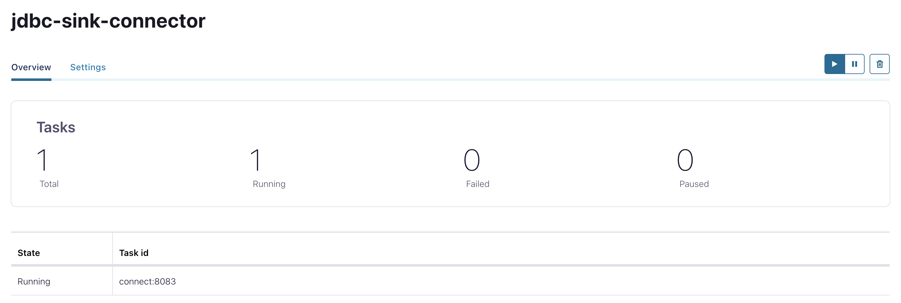
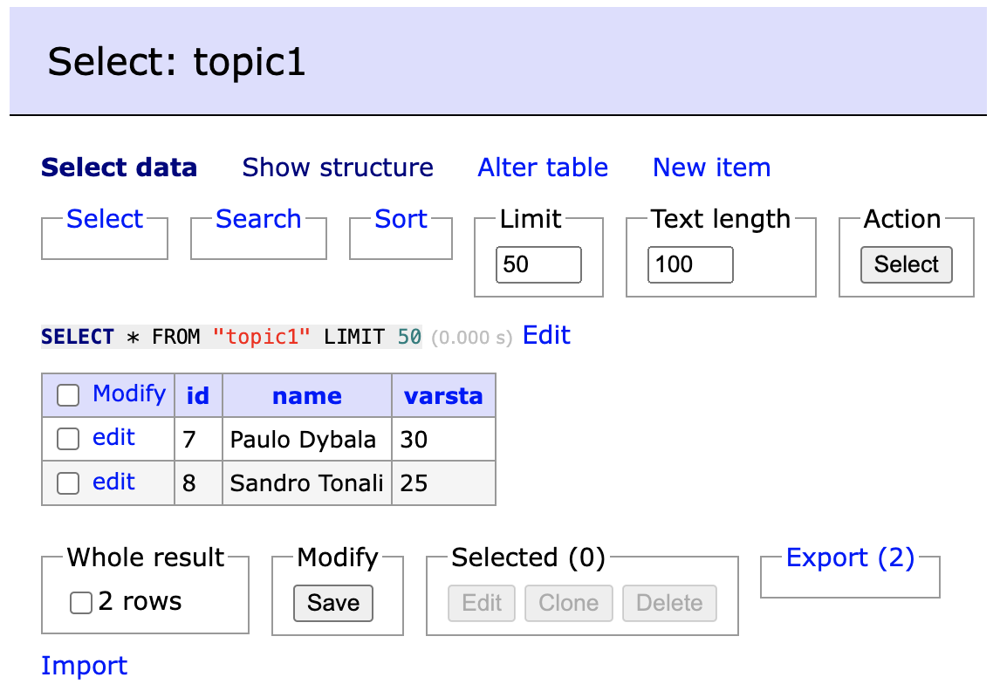

### 1. Add JDBC sink connector http://localhost:9021

**Connect Cluster connect-default -> Add connector -> JDBC Sink Connector-> Upload connector config file -> Select file -> postgres-sink-connector-1.json**


### 2. In schema registry terminal produce avro messages

```bash
kafka-avro-console-producer --bootstrap-server kafka:19092 --topic topic1  --property schema.registry.url=http://schema-registry:8081 --property value.schema="{\"type\":\"record\",\"name\":\"midfielders\",\"fields\":[{\"name\":\"id\",\"type\":\"int\"},{\"name\":\"name\",\"type\":\"string\"},{\"name\":\"varsta\",\"type\":\"int\"}]}"
```
add some data from the terminal
```bash
{"id": 7, "name":"Paulo Dybala", "varsta": 30}       
{"id": 8, "name":"Sandro Tonali", "varsta":25}
```

### 3. Check the data in the database
